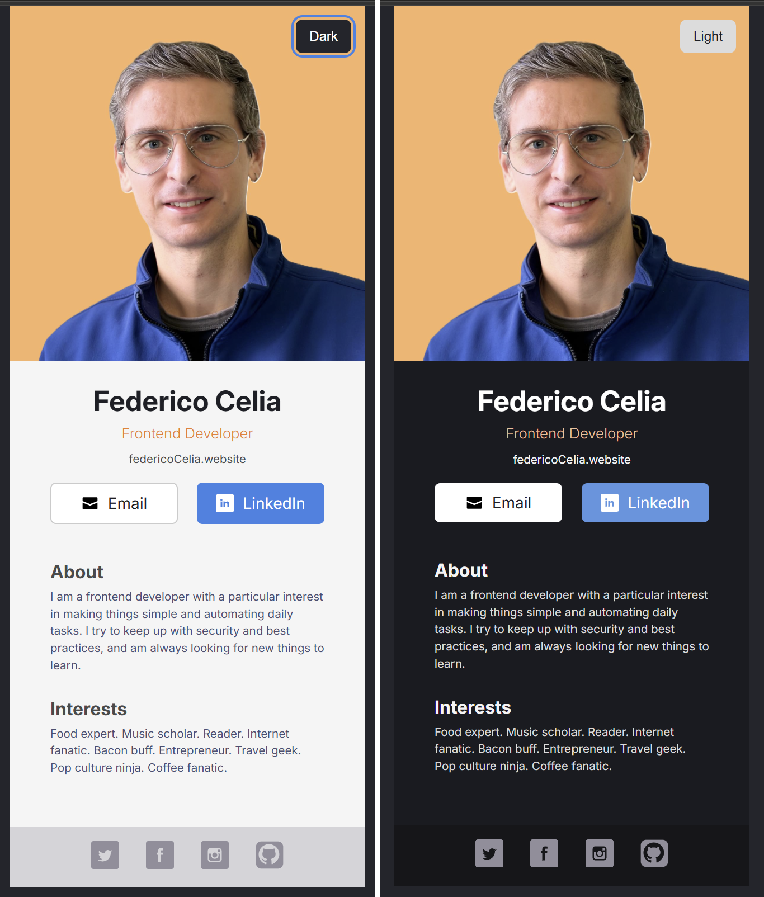

# Digital Business Card (React)

**Digital Business Card** is a themeable personal card built with **React, CSS, and modern JavaScript** as part of the **Scrimba Frontend Developer Career Path**.

The project focuses on **component-based UI**, **CSS custom properties**, **light/dark theme toggling**, and clean, maintainable styling for small static React applications.

---

## 🎨 Preview

> A single-page digital business card with light/dark mode toggle, social links, and themeable SVG icons.
> 

---

## 🛠 Tech Stack

- React (Functional Components)
- JavaScript (ES Modules)
- CSS3 (Custom Properties / Variables)
- HTML5
- SVG (inline, theme-aware)
- Google Fonts (Inter)

---

## ✨ Features

- Component-based layout (`Info`, `About`, `Interests`, `Footer`)
- **Light / Dark mode toggle** with:
  - CSS variables
  - `data-theme` attribute on `<html>`
  - `localStorage` persistence
  - System preference fallback (`prefers-color-scheme`)
- Theme-aware SVG icons (single-color and multi‑tone)
- Accessible toggle button using `aria-pressed`
- Centered, fixed-width layout (`317px`) for app‑like presentation

---

## 📁 Project Structure

```
.
├── index.html
├── src/
│   ├── index.css
│   ├── App.jsx
│   ├── About.jsx
│   ├── Interests.jsx
│   ├── Info.jsx
│   ├── Footer.jsx
│   ├── main.jsx
│   └── assets/
│       └── federico_celia.jpg
```

---

## ▶️ How to Run

1. Install dependencies:

```bash
npm install
```

2. Start the dev server:

```bash
npm run dev
```

3. Open in browser:

```
http://localhost:5173
```

---

## 🧠 Theme System

- Default theme: **Dark**
- Light theme enabled via toggle button
- Theme state:
  - Stored in `localStorage`
  - Applied via `data-theme` on `<html>`
  - Drives all colors through CSS variables

---

## ♿ Accessibility

✅ Implemented:

- Semantic HTML (`section`, `footer`)
- Real toggle `<button>` with `aria-pressed`
- Keyboard focus styles

🔧 Possible improvements:

- Add `aria-label` to social icons
- Fine-tune focus order
- Improve touch target size for icons

---

## 🎯 Learning Goals

This project practices:

- React component composition
- CSS variable theming
- DOM attribute-based styling
- Persistent UI preferences
- SVG theming strategies
- Maintainable CSS architecture

---

## ⚠️ Limitations

- Static content only
- No routing
- No animations beyond basic transitions
- No backend or CMS

---

## 🚀 Future Improvements

- Theme toggle icons (sun / moon)
- Subtle animations
- Downloadable vCard
- Custom hook for theming (`useTheme`)

---

## 👤 Author

**Federico Celia**  
Frontend Developer (in progress)  
🔗 https://www.linkedin.com/in/federico-celia-13b3851a8/

---

## 📄 License

This project is for learning and practice as part of the Scrimba Frontend Developer Career Path.

Recommended license:  
**CC BY‑NC 4.0**  
https://creativecommons.org/licenses/by-nc/4.0/
